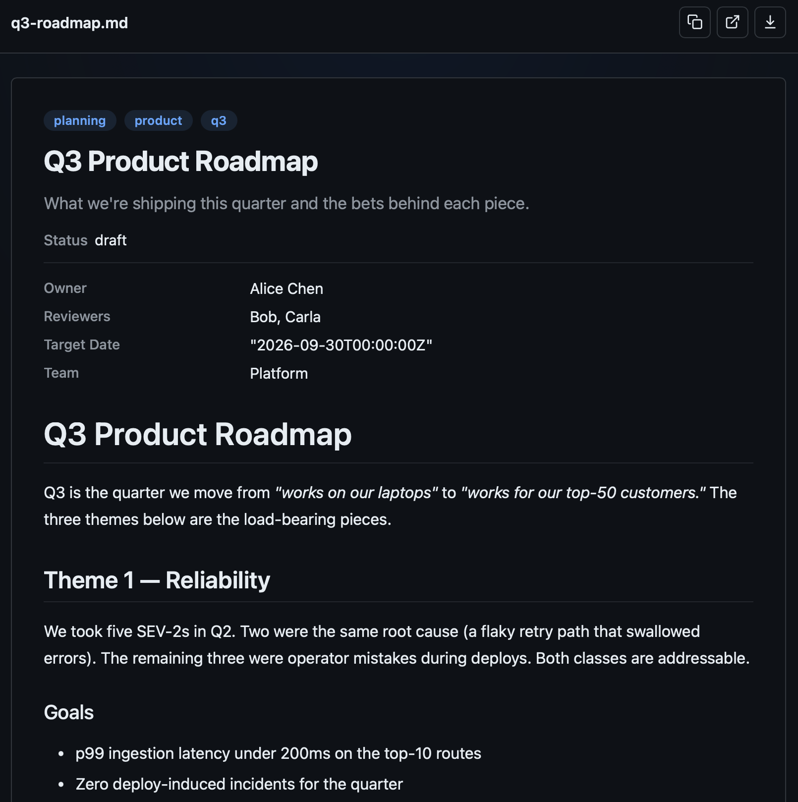
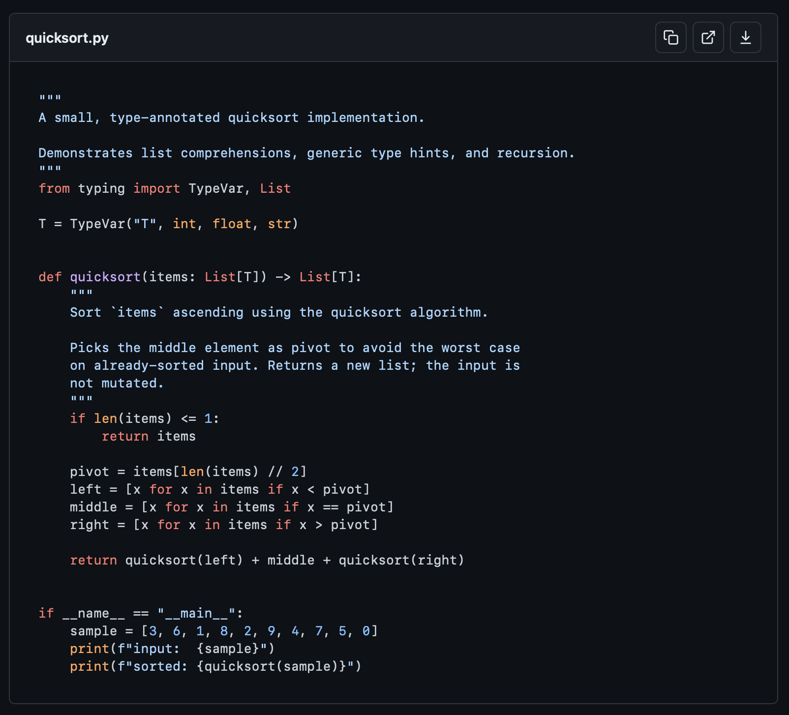
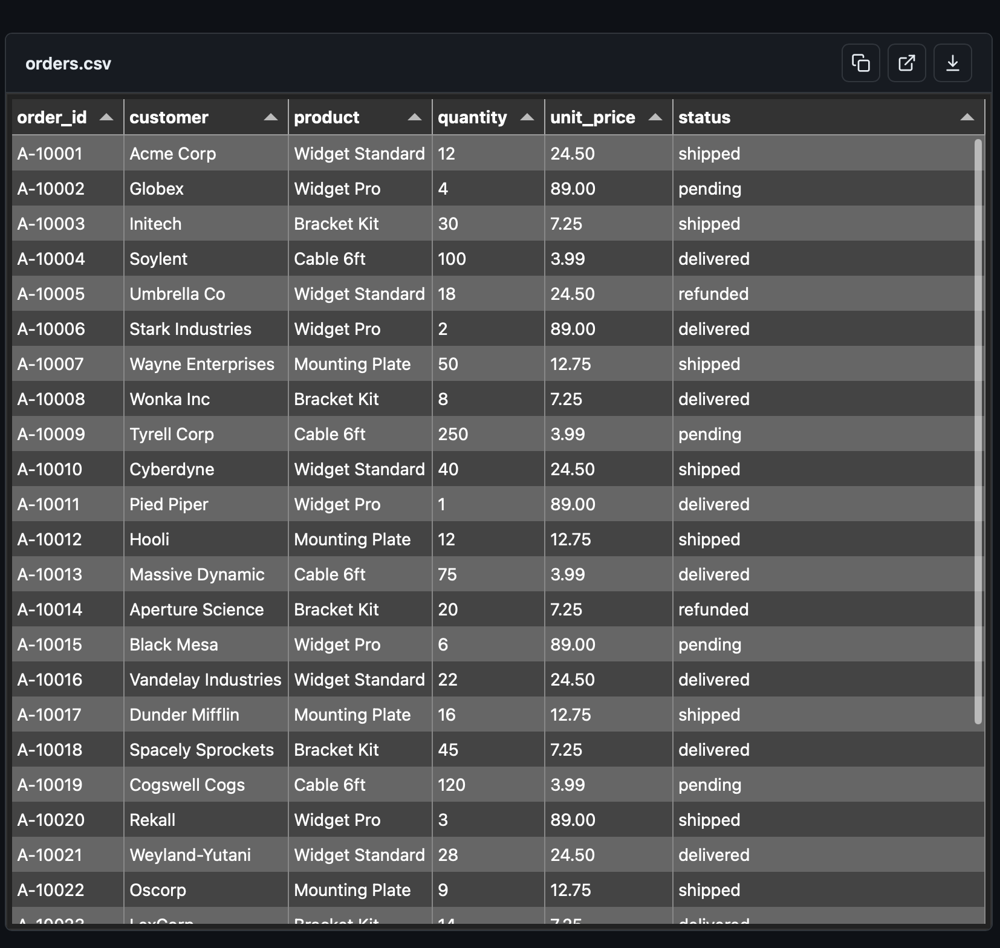
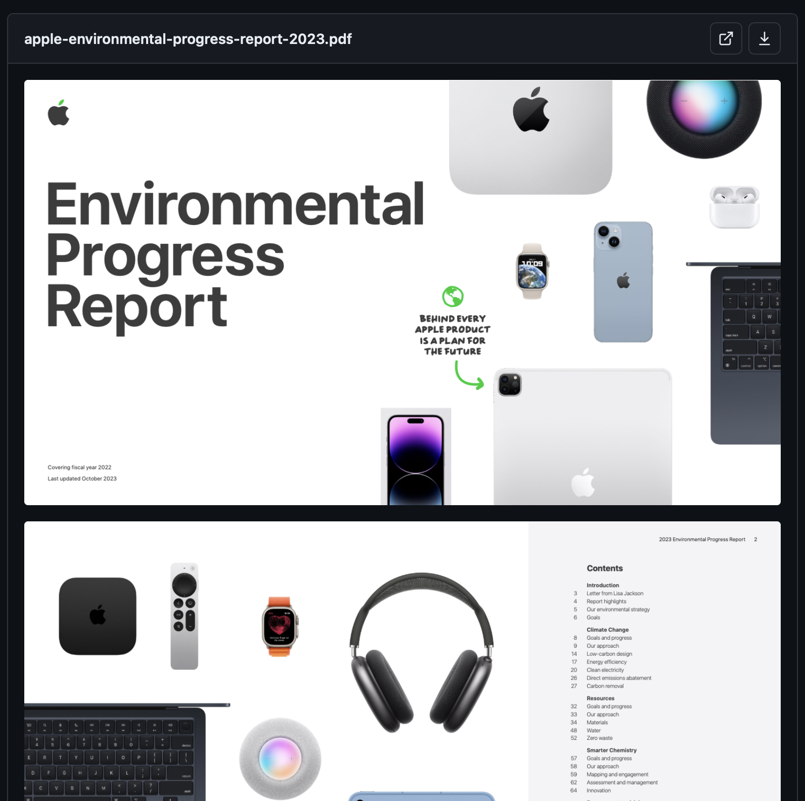
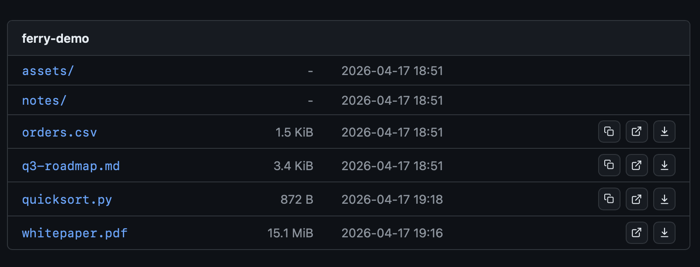
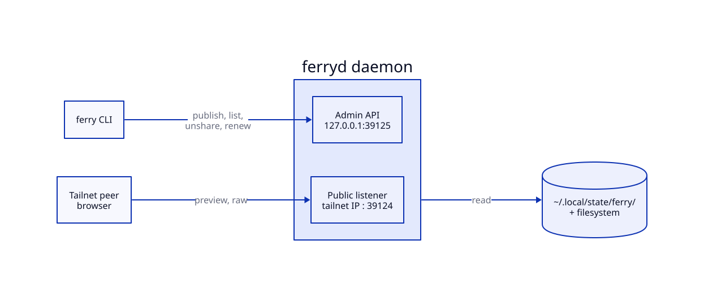

# ferry

[](https://github.com/0xble/ferry/actions/workflows/gate.yml)
[](https://github.com/0xble/ferry/releases)
[](https://pkg.go.dev/github.com/0xble/ferry)
[](LICENSE)

Tailscale-first file sharing CLI. Publish files and directories as
preview-rich URLs scoped to your tailnet, authenticated with per-share
tokens.



## Previews

| | |
|---|---|
| [](docs/assets/preview-code.png) | [](docs/assets/preview-csv.png) |
| [](docs/assets/preview-pdf.png) | [](docs/assets/preview-directory.png) |

## Use it to

- Share a draft markdown with your team. It opens as a polished article,
  not a download.
- Preview a PDF on your phone without an iCloud handoff. Tap, scroll, done.
- Post a CSV link in chat that opens sortable in the browser. No
  spreadsheet app required.

## Features

- Share files and directories as live or snapshot links
- Rich previews: markdown (GFM), code (highlight.js), CSV (Tabulator),
  PDF, images, audio, video, and interactive self-contained HTML
- Sandboxed HTML artifacts execute inline CSS and JavaScript while blocking
  fetch/XHR, external runtime subresources, forms, nested frames, storage, parent/top
  navigation, and Ferry-origin access
- The HTML preview header scrolls away with the artifact. Pin fixed or sticky
  artifact UI below it with `top: var(--ferry-inset-visible, 0px)`;
  `--ferry-inset-top` holds the full header height
- HMAC-SHA256 token auth per share
- Directory listing with breadcrumb navigation
- Automatic share expiry and garbage collection
- Snapshot mode for point-in-time copies

## Usage

`ferry publish` returns a tailnet URL that renders the file as a
polished preview in any browser:

```
$ ferry publish ~/Desktop/q3-roadmap.md
id: y4bLVYZQvSE
kind: file
mode: live
created: 2026-04-17T19:07:42-04:00
expires: 2026-04-24T19:07:42-04:00
url: https://laptop.tail-abc123.ts.net/s/y4bLVYZQvSE?t=veyZiAynxtU
```

Other commands:

```sh
# Publish a file (starts daemon automatically)
ferry publish ~/Desktop/report.pdf

# Publish a directory
ferry publish ~/Projects/docs/

# Snapshot mode (point-in-time copy)
ferry publish --snapshot ~/Desktop/draft.md

# ferryd config.toml: cap snapshot copies at 1 GiB by default
# snapshot-max-bytes = 1073741824

# Custom expiry (default: 7d)
ferry publish --expires-in 24h ~/Desktop/notes.txt

# List active shares
ferry list

# Get a share by id
ferry get <id>

# Extend share expiry
ferry renew <id>

# Revoke a share by id or exact path
ferry unshare <target>

# Check daemon and Tailscale health
ferry doctor

# Preview a publish, renewal or revocation without changing anything
ferry publish --dry-run ~/Desktop/report.pdf
```

`--json` prints JSON on every command, and errors become a JSON envelope on
stderr, `{"error":{"code","message","exit_code"}}`. Exit codes: 0 success, 1
error, 2 usage, 3 not found.

### Operations API and MCP

The client is built on [toolkit](https://github.com/0xble/toolkit), so the
same operations are also an HTTP API and MCP tools:

```sh
ferry metadata --json                      # every operation and its schema
ferry mcp                                  # MCP over stdio: list, get, doctor
ferry serve --socket ~/.local/state/ferry/ops.sock
```

`ferry serve` serves the operations on a `0600` Unix socket and refuses
applied writes by default. It is not `ferryd serve`, the share server.
Publishing takes a local path, so `publish` accepts its path (and `--open`)
only on the command line.

## How it compares

| Tool                    | Tailnet-scoped | Rich previews | Per-share token | Snapshot | Auto expiry |
|-------------------------|----------------|---------------|-----------------|----------|-------------|
| ferry                   | yes            | yes           | yes             | yes      | yes         |
| Taildrop                | yes            | no            | identity        | no       | no          |
| Tailscale Serve         | optional       | no            | optional        | no       | no          |
| caddy file-server       | no             | no            | no              | no       | no          |
| python -m http.server   | no             | no            | no              | no       | no          |

## Architecture

`ferry` is the client CLI. `ferryd` is the background daemon that runs
three HTTP listeners.



- **Public** (tailnet IP, port 39124): preview and raw file endpoints
- **Loopback** (127.0.0.1, port 39124): same as public, for local access
- **Admin** (Unix socket `~/.local/state/ferry/admin.sock`): share CRUD API
  used by the `ferry` client

State is stored in `~/.local/state/ferry/` with the HMAC secret in a
0600-mode file under a 0700-mode directory.

## Requirements

- [Tailscale](https://tailscale.com)

## Install

```sh
go install github.com/0xble/ferry/cmd/ferry@latest
go install github.com/0xble/ferry/cmd/ferryd@latest
```

## Contributing

See [CONTRIBUTING.md](CONTRIBUTING.md).

## Security

See [SECURITY.md](SECURITY.md). Report vulnerabilities privately through
GitHub Security Advisories.

## License

MIT
